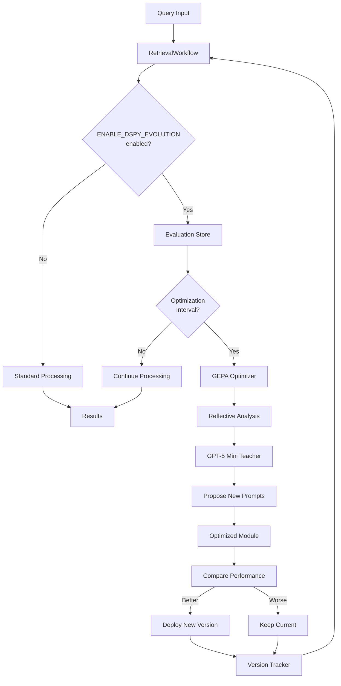

# Self-Evolving DSPy Agent Implementation Plan

## Architecture Overview



## Feature Flag Control

The self-evolution system is controlled by the `ENABLE_DSPY_EVOLUTION` flag:

- **Default: `false`** - System runs in standard mode without evolution
- **When `true`** - Enables evaluation collection and automated optimization
- Can be toggled via environment variable or config parameter
- No performance impact when disabled (zero overhead)

### Flag Behavior Details

**When ENABLE_DSPY_EVOLUTION=false (Default)**:

- Workflow runs in standard mode
- No evaluation data collected
- No optimization attempts
- No OpenAI API calls for teacher model
- dspy_picker uses default pre-trained module (if available)
- Zero overhead - system behavior identical to current implementation

**When ENABLE_DSPY_EVOLUTION=true**:

- Evaluation data collected for each query
- Automated optimization triggered every N queries
- GPT-5 Mini teacher model called during optimization only
- Module versions tracked and can be rolled back
- Improved modules automatically deployed when performance increases

**How to Enable**:

```bash
# In .env file
ENABLE_DSPY_EVOLUTION=true

# Or via environment variable
export ENABLE_DSPY_EVOLUTION=true
python scripts/run_evolution.py

# Or programmatically
workflow = RetrievalWorkflow(enable_evolution=True)
```

## Phase 1: Core Infrastructure

### 1.1 Create Evaluation Storage System

**File**: `src/evaluation/eval_store.py`

Implement persistent evaluation storage with:

- `QueryEvaluation` dataclass for individual query results
- `EvaluationStore` class with JSON file persistence
- Methods: `add_evaluation()`, `get_failures()`, `get_successes()`, `to_dspy_trainset()`
- Storage location: `data/evaluations/` directory
- **Add `is_enabled()` helper to check `ENABLE_DSPY_EVOLUTION` flag**

Key features:

- Store query, retrieved papers, ground truth, metrics, and scores
- Filter by score thresholds for training set creation
- Convert to DSPy Example format for optimization
- Gracefully handle disabled state (no-op when flag is False)

### 1.2 Create DSPy Metric Functions

**File**: `src/evaluation/dspy_metrics.py`

Implement optimization metrics:

- `citation_retrieval_metric()`: Weighted combination of correct selection (40%), Recall@5 (30%), Recall@10 (20%), MRR (10%)
- `query_reformulation_metric()`: Measure diversity and quality of reformulated queries
- Both should accept `(example, prediction, trace)` signature for DSPy compatibility

### 1.3 Create Module Version Tracker

**File**: `src/agents/self_evolve/version_tracker.py`

Implement version management:

- `ModuleVersion` dataclass: stores module state, score, timestamp, metadata
- `VersionTracker` class: manages version history with file persistence
- Methods: `add_version()`, `get_best()`, `get_current()`, `rollback_to()`
- Storage: `data/module_versions/{module_name}/` with pickle files
- Track: module weights, score, timestamp, training data hash

## Phase 2: DSPy Module Wrappers

### 2.1 Create Optimizable Query Reformulator Module

**File**: `src/agents/formulators/dspy_reformulator.py`

Convert existing query reformulator to DSPy module:

- Create `QueryReformulationSignature` with `query -> queries, reasoning`
- Implement `DSPyQueryReformulator(dspy.Module)` with ChainOfThought
- Add `forward()` method that returns list of reformulated queries
- Maintain compatibility with existing workflow interface

### 2.2 Enhance DSPy Picker Module

**File**: Modify `src/agents/formulators/dspy_picker.py`

Add self-evolution support:

- Load optimized module from version tracker if available
- Fall back to default module if no optimized version exists
- Add tracing/logging for evaluation collection

## Phase 3: Self-Evolution Engine

### 3.1 Core Evolution Loop

**File**: `src/agents/self_evolve/evolution_engine.py`

Implement `SelfEvolvingRetrievalSystem` class:

**Initialization**:

- **Check `ENABLE_DSPY_EVOLUTION` flag first - exit early if False**
- Configure local Gemma model for inference
- Configure GPT-5 Mini teacher model
- Load existing module versions from disk
- Initialize evaluation store
- Set internal `_evolution_enabled` flag based on env var

**Key Methods**:

1. `evaluate_batch()`: Run queries through workflow, collect metrics, store evaluations

   - **Return immediately if `_evolution_enabled` is False**
   - Extract query from paper text
   - Get ground truth citations
   - Run through workflow
   - Calculate weighted score
   - Store in evaluation store

2. `optimize_module()`: Run GEPA optimization

   - Load training/validation sets from evaluation store (min_score=0.5)
   - Split data into trainset and valset (90/10 split)
   - Configure GEPA with GPT-5 Mini reflection LM
   - Run reflective optimization with feedback trajectories
   - Compile optimized module
   - Evaluate on validation set
   - Compare with current version

3. `deploy_or_rollback()`: Version management

   - Compare new vs current module scores
   - Deploy if improvement > threshold (e.g., 5%)
   - Update workflow with new module
   - Save version to disk

4. `continuous_evolution_loop()`: Main loop

   - **Check flag at start - log message and return if disabled**
   - Process queries in batches (eval_interval=100)
   - Trigger optimization every N queries (optimize_interval=1000)
   - Auto-deploy improvements
   - Log all decisions

### 3.2 MIPROv2 Configuration

**File**: `src/agents/self_evolve/optimizers.py`

Create optimizer factory and adapter:

**GEPAAdapter Class**:

- Implement required methods: `evaluate()`, `get_components_to_update()`, `make_reflective_dataset()`
- `evaluate()`: Run queries through workflow, collect grader scores and feedback
- `get_components_to_update()`: Return list of prompt fields to optimize
- `make_reflective_dataset()`: Package inputs, outputs, and feedback for reflection

**get_gepa_optimizer() Function**:

- Configure GEPA with reflection LM (GPT-5 Mini)
- Parameters: metric, reflection_lm, max_metric_calls, track_best_outputs
- Auto-budget setting: 'light', 'medium', or 'heavy'
- Return configured GEPA optimizer instance

## Phase 4: Workflow Integration

### 4.1 Extend RetrievalWorkflow

**File**: Modify `src/workflow.py`

Add methods:

- `update_dspy_module(module_name, new_module)`: Hot-swap DSPy modules
- `update_reformulator(new_reformulator)`: Update query reformulator
- `get_module_versions()`: Return current versions of all modules
- Store modules in `self._optimized_modules` dict
- **`is_evolution_enabled()`: Check ENABLE_DSPY_EVOLUTION flag**

Update `__init__()`:

- **Add `enable_evolution` parameter (default=False)**
- Read from env var `ENABLE_DSPY_EVOLUTION` if not specified
- Store flag in instance variable

Update `_build_workflow()`:

- **Only check for optimized modules if evolution is enabled**
- Use optimized versions if available and flag is True
- Fall back to default implementations

### 4.2 Update State Model

**File**: Modify `src/models/state.py`

Add state fields:

- `module_version`: Track which module version was used
- `evaluation_metadata`: Store data for later evaluation
- `optimization_enabled`: Flag to enable/disable optimization mode

## Phase 5: Execution Scripts

### 5.1 Main Evolution Script

**File**: `scripts/run_evolution.py`

Complete workflow:

1. **Check ENABLE_DSPY_EVOLUTION flag - exit with message if False**
2. Load dataset and build resources
3. Initialize RetrievalWorkflow with `enable_evolution=True`
4. Create SelfEvolvingRetrievalSystem
5. Run initial baseline evaluation (100 queries)
6. Start continuous evolution loop
7. Log progress and scores to console and file

Configuration via environment variables:

- **`ENABLE_DSPY_EVOLUTION=false` (default, must be explicitly enabled)**
- `EVOLUTION_EVAL_INTERVAL=100`
- `EVOLUTION_OPTIMIZE_INTERVAL=1000`
- `EVOLUTION_MIN_IMPROVEMENT=0.05`
- `TEACHER_MODEL=openai/gpt-5-mini`
- `STUDENT_MODEL=ollama_chat/gemma:2b`

### 5.2 One-Time Optimization Script

**File**: `scripts/optimize_once.py`

For testing and development:

1. **Temporarily enable evolution (override flag for this script)**
2. Run baseline evaluation
3. Optimize with MIPROv2
4. Run post-optimization evaluation
5. Compare and report results
6. Save best module
7. Optionally update .env to enable evolution permanently

## Phase 6: Monitoring and Observability

### 6.1 Logging System

**File**: `src/agents/self_evolve/monitoring.py`

Implement:

- `EvolutionLogger`: Structured logging for optimization events
- Log to: console, file (`logs/evolution_{timestamp}.log`)
- Metrics: scores over time, optimization attempts, deployments, rollbacks
- CSV export for analysis

### 6.2 Metrics Dashboard

**File**: `scripts/analyze_evolution.py`

Generate reports:

- Plot score progression over time
- Compare module versions
- Analyze failure cases
- Export summary statistics

## Phase 7: Testing

### 7.1 Unit Tests

**File**: `tests/test_evolution_engine.py`

Test cases:

- Evaluation storage and retrieval
- Version tracking and rollback
- Metric calculations
- Module hot-swapping

### 7.2 Integration Tests

**File**: `tests/test_self_evolution_integration.py`

End-to-end tests:

- Run mini evolution loop (10 queries)
- Verify optimization improves scores
- Test rollback on regression
- Verify persistence across restarts

## Implementation Order

### Step 1: Foundation (Day 1)

1. **Update `.env.example` with `ENABLE_DSPY_EVOLUTION=false` flag**
2. Create `src/evaluation/eval_store.py` with flag checking
3. Create `src/evaluation/dspy_metrics.py`
4. Create `src/agents/self_evolve/version_tracker.py`
5. Create storage directories: `data/evaluations/`, `data/module_versions/`

### Step 2: DSPy Modules (Day 2)

5. Create `src/agents/formulators/dspy_reformulator.py`
6. Enhance `src/agents/formulators/dspy_picker.py`
7. Create `src/agents/self_evolve/optimizers.py` with GEPA adapter and configuration

### Step 3: Evolution Engine (Day 3)

8. Create `src/agents/self_evolve/evolution_engine.py` with flag checks
9. Implement `evaluate_batch()` and `optimize_module()` methods with early returns when disabled
10. Add workflow integration methods to `src/workflow.py` with `enable_evolution` parameter

### Step 4: Execution & Monitoring (Day 4)

11. Create `scripts/optimize_once.py` for testing
12. Create `scripts/run_evolution.py` for production
13. Create `src/agents/self_evolve/monitoring.py`
14. Add tests

### Step 5: Deployment (Day 5)

15. Update `README.md` with evolution system documentation
16. Create example configurations
17. Test full pipeline end-to-end
18. Create analysis/dashboard script

## Key Technical Decisions

**DSPy Configuration**:

- Student model: Gemma 2B via Ollama (local, fast inference)
- Reflection LM: GPT-5 Mini via OpenAI API (optimization only)
- Optimizer: GEPA with auto='medium', max_metric_calls=50
- GEPA uses reflective prompt evolution with validation-based selection

**Optimization Triggers**:

- Evaluate every 100 queries (collect data)
- Optimize every 1000 queries (GPT-5 Mini call)
- Deploy if improvement >= 5%

**Storage Structure**:

```
data/
├── evaluations/
│   ├── batch_{timestamp}.json
│   └── summary.json
├── module_versions/
│   ├── picker/
│   │   ├── v0.pkl
│   │   ├── v1.pkl
│   │   └── metadata.json
│   └── reformulator/
│       ├── v0.pkl
│       └── metadata.json
└── logs/
    └── evolution_{timestamp}.log
```

## Environment Variables

Add to `.env`:

```bash
# Self-Evolution Settings
EVOLUTION_ENABLED=true
EVOLUTION_EVAL_INTERVAL=100
EVOLUTION_OPTIMIZE_INTERVAL=1000
EVOLUTION_MIN_IMPROVEMENT=0.05
TEACHER_MODEL=openai/gpt-5-mini
STUDENT_MODEL=ollama_chat/gemma:2b
EVOLUTION_DATA_DIR=./data
```

## Success Criteria

1. **System runs normally when ENABLE_DSPY_EVOLUTION=false (no overhead)**
2. System successfully evaluates queries and stores results when enabled
3. GEPA optimizer runs without errors using GPT-5 Mini as reflection LM
4. Optimized modules improve scores by >= 5%
5. Module versions persist and reload correctly
6. Continuous loop runs for 1000+ queries without crashes
7. Rollback works when new module performs worse
8. **Flag can be toggled without code changes (env var only)**

## Dependencies to Add

Update `pyproject.toml`:

```toml
dependencies = [
    # ... existing ...
    "gepa>=0.1.0",  # REQUIRED: Genetic-Pareto optimizer for reflective prompt evolution
]
```

**Installation**:

```bash
# Add to pyproject.toml, then:
uv sync
# or
pip install gepa
```

## Monitoring Output Examples

### When ENABLE_DSPY_EVOLUTION=false (Default)

```
[2025-01-15 10:00:00] Retrieval workflow initialized (evolution disabled)
[2025-01-15 10:00:01] Processing query 1/100...
[2025-01-15 10:00:02] Query complete: 10 papers retrieved
...
```

### When ENABLE_DSPY_EVOLUTION=true (Evolution Active)

```
[2025-01-15 10:00:00] DSPy Evolution ENABLED - Starting evolution loop...
[2025-01-15 10:00:05] Baseline evaluation: 100 queries, avg_score=0.623
[2025-01-15 10:15:30] Processed 1000 queries, triggering optimization...
[2025-01-15 10:15:35] GEPA: Training on 847 examples (score >= 0.5)
[2025-01-15 10:15:36] GEPA: Split into trainset=762, valset=85
[2025-01-15 10:15:37] GEPA: Starting reflective optimization (auto='medium')
[2025-01-15 10:17:15] GEPA: Reflection iteration 1/5 - score=0.641
[2025-01-15 10:18:22] GEPA: Reflection iteration 2/5 - score=0.668
[2025-01-15 10:19:08] GEPA: Reflection iteration 3/5 - score=0.681
[2025-01-15 10:19:42] GEPA: Optimization complete (4min 7s, best_score=0.681)
[2025-01-15 10:20:15] Validation: new_score=0.681, current_score=0.623
[2025-01-15 10:20:15] Improvement: +0.058 (9.3%), DEPLOYING v1
[2025-01-15 10:20:16] Module picker updated to v1
[2025-01-15 10:20:16] Continuing evolution loop...
```

### When Evolution Script Run with Flag Disabled

```
[2025-01-15 10:00:00] Error: ENABLE_DSPY_EVOLUTION is not enabled
[2025-01-15 10:00:00] Set ENABLE_DSPY_EVOLUTION=true in .env to enable evolution
[2025-01-15 10:00:00] Current mode: Standard retrieval only
```